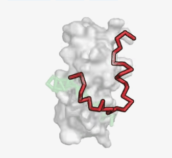
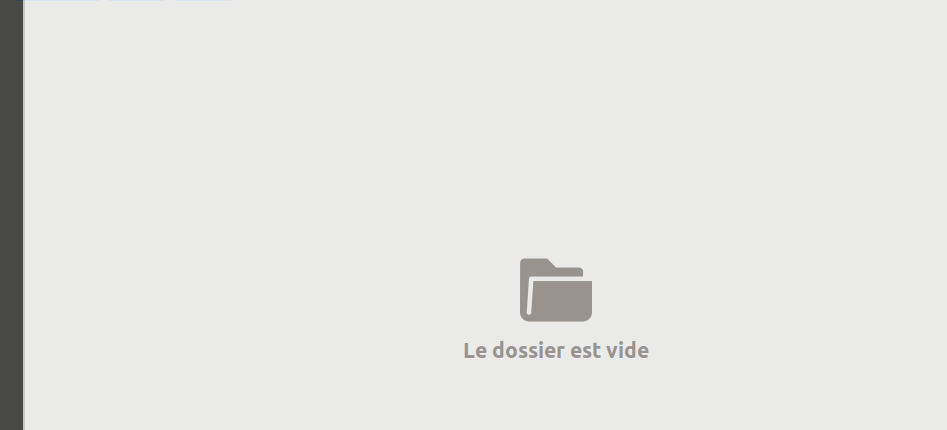

# PyGifScreenshot

## Description :
This is a small python script to generate animated screenshots

---



---

## Requirements :

### System :
* Linux : 
The code has only been tested on Ubuntu.

### Python packages :
In order to be able to run this code of course you need to have python3 but also some python packages :

* [`PySimpleGUI`](https://pysimplegui.readthedocs.io/en/latest/)
* [`PyAutoGUI`](https://pyautogui.readthedocs.io/en/latest/)
* [`OpenCV`](https://docs.opencv.org/4.5.2/index.html)
* [`imageio`](https://imageio.readthedocs.io/en/stable/)
* [`Xlib`](https://github.com/python-xlib/python-xlib)


PyPi installation :
```shell
$pip install PySimpleGUI
$pip install tk
$python3 -m pip install pyautogui
$pip install imageio
$pip install opencv-python
$pip install python-xlib
```

Conda installation :
```bash
$conda install -c conda-forge pysimplegui
$conda install -c anaconda tk
$conda install -c conda-forge pyautogui
$conda install -c conda-forge opencv
$conda install -c conda-forge imageio
$conda install -c conda-forge python-xlib
```

---

## Usage :

1. First clone this repository :
```shell
$git clone https://github.com/hocinebib/PisaPy.git
```
or [download](https://github.com/hocinebib/PyAnimatedScreenshot/archive/refs/heads/main.zip) it.

2. Then run the script :
```shell
$cd PyGifScreenShot/
$python src/PyGifScreenShot.py
```

3. A semi transparent window will appear

4. Resize it to fit what you want to take a screenshot of
5. Give a file name
6. Click on `Generate` to start taking the screenshots
7. Click on `Stop` to stop
8. The animated gif file will be created in the ScreenShots folder

---

### Examples:



---


